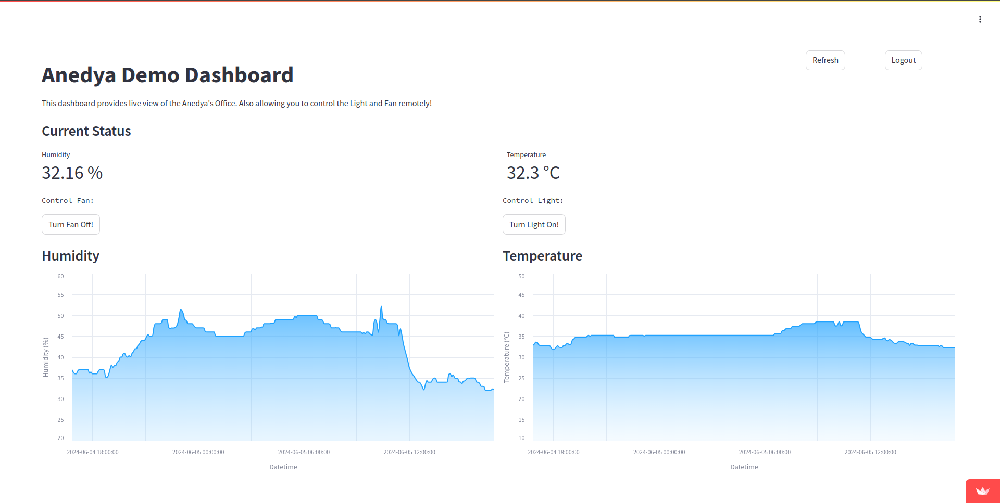

[](https://docs.anedya.io?utm_source=github&utm_medium=link&utm_campaign=github-examples&utm_content=streamlit-dashboard)

# anedya-streamlit-dashboard-example
An example dashboard developed in streamlit

<p align="center">
    
</p>
The Anedya IoT cloud enables users to monitor and control IoT devices remotely. The dashboard displays real-time data on humidity and temperature, as well as providing control buttons to operate a fan and a light. The control buttons sync with real-time changes, reflecting the current state of the devices. 




## Features
- **User Authentication:** Basic login functionality.
- **Live Data Visualization**: Real-time humidity and temperature charts using Altair.
- **Device Control:** Buttons to turn the fan and light on and off, syncing with real-time changes.
- **Automatic Data Refresh:** Auto-refresh functionality for live updates.

## Setup and Configuration
- **Node ID:** Obtain the Node ID from the Anedya dashboard by navigating to the project section and selecting the node.
- **API Key:** Obtain the API key from the Anedya dashboard by navigating to the project -> APIKEY.

## Usage

### Running Locally
1. Clone the Repository:
Clone aneday-streamlit-dashboard-example repo from anedya github.
```
git clone https://github.com/anedyaio/anedya-streamlit-dashboard-example.git
cd anedya-streamlit-dashboard-example

```
2. Install Dependencies:
To ensure the application has all the necessary libraries, you'll need to install the dependencies listed in the requirements.txt file. This file contains a list of all the packages along with their versions that the app depends on.
Here's how to install these dependencies:
- Open a terminal or command prompt.
- Navigate to the directory where you cloned the repository.
- Run the following command to install the dependencies using pip:
```
pip install -r requirements.txt
This command reads the `requirements.txt` file and installs all the listed packages.
```
3. Run the Streamlit App:
Start the Streamlit server:
```
streamlit run Home.py

```
This will launch the dashboard in your default web browser.

### Hosting on Streamlit Cloud

1. Fork the Repository:
Fork this repository to your own GitHub account.
2. Sign Up / Log In to Streamlit Cloud:
Go to [Streamlit Cloud](https://streamlit.io/cloud) and sign in with your GitHub account.
3. Create a New App:
- Click on "New app".
- Select your forked repository.
- Set the branch to main (or the branch you want to deploy from).
- Set the main file path to Home.py.
4. Deploy:
Click "Deploy" to launch your app on Streamlit Cloud.

## License

This project is licensed under the [MIT License](https://github.com/anedyaio/anedya-example-nodemcu/blob/main/LICENSE).

>[!TIP]
>For Anedya documentation, click [here](https://docs.anedya.io/?utm_source=github&utm_medium=link&utm_campaign=github-examples&utm_content=streamlit-dashboard).

>[!TIP]
> For more information, visit [anedya.io](https://anedya.io/?utm_source=github&utm_medium=link&utm_campaign=github-examples&utm_content=streamlit-dashboard)
 
